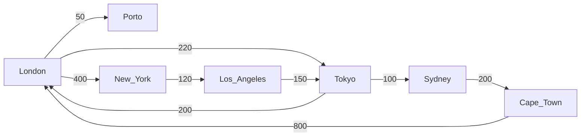

# Test project to play with Dijkstra's algorithm. 
Task - to find cheappest path between some cities using this [sample data](https://raw.githubusercontent.com/TuiMobilityHub/ios-code-challenge/master/connections.json)

